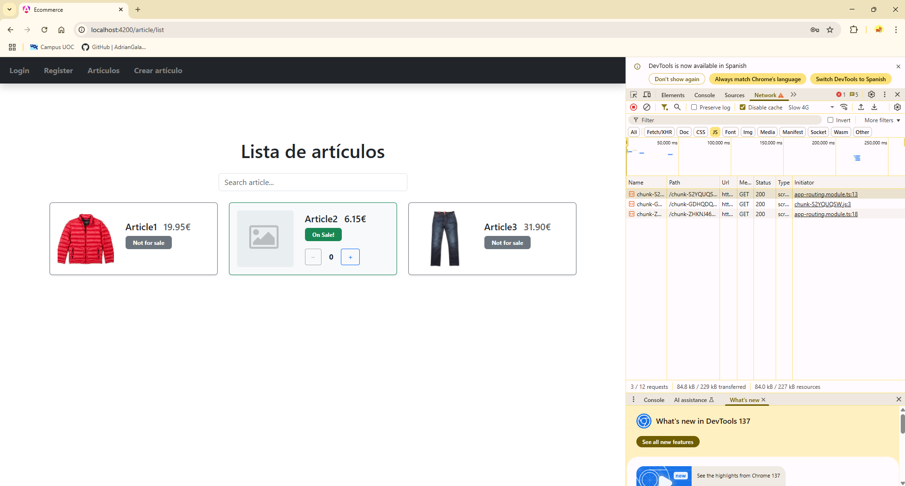
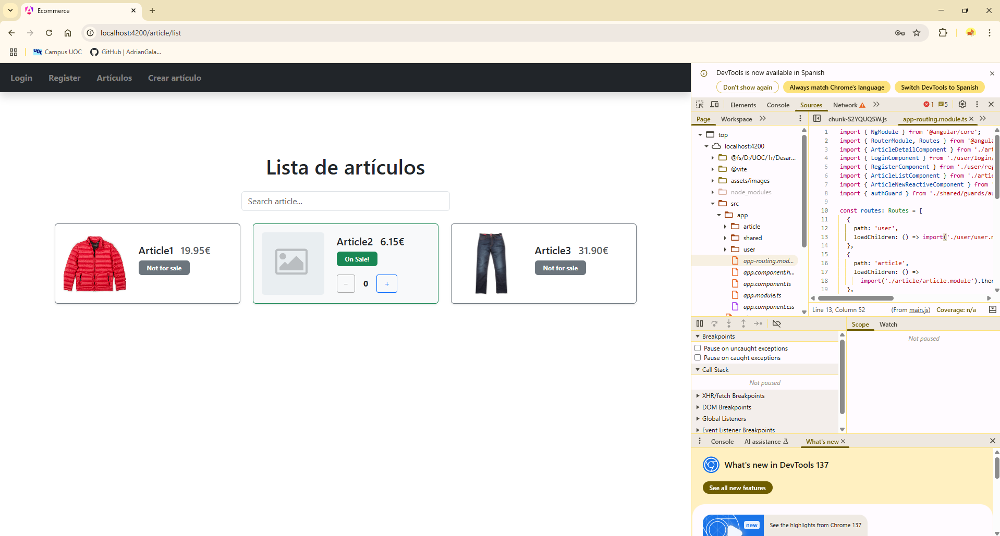

# PEC 7: Frameworks: Routing en Angular
Login UOC: agalanpa

Alumno: Adrián Galán Pacheco

## Descripción de la práctica
Esta práctica se compone de tres ejercicios.

### Ejercicio 1: Preguntas teóricas
Este ejercicio consiste en responder siete preguntas teórcias sobre `RouterLink`, `routerLinkActive`, `ActivatedRouteSnapshot`, route guards, carga Lazy, `canDeactivate`, `canActivate` y middlewares.

No me ha resultado complicado gracias a la documentación que hay por Internet. Para la primera y segunda pregunta he usado la documentación oficial de Angular sobre [RouterLink](https://v17.angular.io/api/router/RouterLink), [RouterLinkActive](https://v17.angular.io/api/router/RouterLinkActive), [RouterLinkWithHref](https://v17.angular.io/api/router/RouterLinkWithHref) y [RouterOutlet](https://v17.angular.io/api/router/RouterOutlet). Para la tercera pregunta he usado también la documentación oficial de Angular sobre [ActivatedRouteSnapshot](https://v17.angular.io/api/router/ActivatedRouteSnapshot). Para la cuarta pregunta he consultado información sobre [Router](https://v17.angular.io/guide/router) y sus guardas [CanActivateFn](https://v17.angular.io/api/router/CanActivateFn), [CanActivateChildFn](https://v17.angular.io/api/router/CanActivateChildFn), [CanDeactivateFn](https://v17.angular.io/api/router/CanDeactivateFn), [CanMatchFn](https://v17.angular.io/api/router/CanMatchFn), [ResolveFn](https://v17.angular.io/api/router/ResolveFn) y [CanLoadFn](https://v17.angular.io/api/router/CanLoadFn). Para la quinta pregunta he consultado la guía sobre [Lazy Loading](https://v17.angular.io/guide/lazy-loading-ngmodules). Para la sexta pregunta he usado la documentación sobre ambos guards: [CanDeactivateFn](https://v17.angular.io/api/router/CanDeactivateFn) y [CanActivateFn](https://v17.angular.io/api/router/CanActivateFn). Para la última pregunta he aplicado mis conocimientos adquiridos en la asignatura.

### Ejercicio 2: Routing
Este ejercicio consiste en cuatro actividades: Creación de componentes, servicios e interceptores, configuración del routing, protección de rutas y recuerdo del login.

Este ejercicio me ha resultado bastante complicado de realizar, pero poco a poco he podido alcanzar el resultado esperado. Gracias la documentación que he encontrado por Internet y ejemplos en YouTube he sido capaz de realizar cada una de las actividades.

### Ejercicio 3: Práctica sobre Lazy-Loading
Este ejercicio consiste en crear dos módulos (User y Article) que se carguen de manera lazy. El resto de directorios se pueden considerar como shared.

Este ejercicio ha sido más facil que el Ejercicio 2, pero ha tenido su dificultad ya que, hay muchos archivos (algunos no se usan pero son de prácticas anteriores). Gracias al paso a paso de la documentación oficial de Angular sobre [Lazy Loading](https://v17.angular.io/guide/lazy-loading-ngmodules), he sido capaz de implementarla correctamente. Al final, se pide adjuntar una imagen donde se visualice que se están cargando los módulos de manera Lazy. Por lo visto, Angular genera nombres aleatorios para los chunks y no muestran explícitamente el nombre de los módulos. Sin embargo, he adjuntado dos capturas de pantalla: en la primera se visualizan los dos chunks y a qué línea de código se relacionan y, en la segunda se visualizan las líneas de código correspondientes. Por lo tanto, el primer chunk se vincula al Lazy Loading de User y el último chunk se vincula al Lazy Loading de Article.

*Primera imagen del Inspector de Elementos, donde se pueden visualizar los chunks*

*Segunda imagen del Inspector de Elementos, donde se pueden ver las líneas de código vinculadas a los chunks*